# Beelzebub

**Open-source deception framework.**

Deploy realistic decoys. Observe attacker behavior. Turn interactions into security evidence.

**[Explore Beelzebub Platform](https://beelzebub.ai/products/beelzebub-cloud/)** · [Documentation](https://docs.beelzebub.ai) · [Quick start](#get-started)

[](https://github.com/beelzebub-labs/beelzebub/actions/workflows/main.yml)
[](https://codecov.io/gh/beelzebub-labs/beelzebub)
[](LICENSE)
[](https://pkg.go.dev/github.com/beelzebub-labs/beelzebub/v3)
[](https://github.com/avelino/awesome-go)

Beelzebub gives security teams a configurable way to study activity directed at decoy services. Define the environment an attacker encounters, choose how it responds, and capture the interaction for investigation. Run the framework independently or connect it to Beelzebub Platform.

## Why Beelzebub

- **Deploy decoys that fit your environment.** Define services, routes, and response rules in YAML. Use static handlers for predictable behavior or LLM-powered responses for adaptive interactions. Extend the runtime with trusted Go plugins when you need custom behavior.
- **Observe what happens after contact.** Capture evidence from decoy interactions, including commands, HTTP request details, and session context, depending on the protocol. Give analysts a record of activity directed at the service to support investigation.
- **Bring evidence into your workflow.** Inspect logs locally, publish structured events to RabbitMQ, or enable Beelzebub Platform reporting. Monitor runtime activity through Prometheus metrics and choose where captured data is sent.

## See it in action

Watch an LLM-powered decoy respond to attacker input. The demo illustrates how generated responses can sustain an interaction beyond a fixed set of command handlers.


## How it works

[](docs/public/readme/how-it-works.svg)

Define services and rules in YAML, validate the configuration, and start the runtime. Trusted Go plugins are compiled into the runtime to extend services and responses. Each service handles incoming interactions and emits evidence through the configured event output. LLM responses require a configured provider; static handlers can run without one.

The framework supports **SSH, HTTP, TCP, TELNET, and MCP**. MCP decoys expose bait tools that make suspicious invocations observable during controlled agent testing. They can provide evidence of prompt-injection attempts; they do not guarantee detection of every attempt.

Deployment options include a local Go binary, Docker Compose, and Kubernetes with Helm. See the [architecture guide](https://docs.beelzebub.ai/concepts/architecture) for runtime behavior and extension boundaries.

## Explore the decoys

Start with one of the **18 example configurations** in [configurations/services](configurations/services). Open a YAML file to inspect its rules and adapt it to your environment.

| Category | Example decoys |
| --- | --- |
| Remote access | [SSH](configurations/services/ssh-22.yaml) · [SSH (LLM)](configurations/services/ssh-2222.yaml) · [TELNET](configurations/services/telnet-23.yaml) · [RDP](configurations/services/tcp-3389-rdp.yaml) · [VNC](configurations/services/tcp-5900-vnc.yaml) |
| Web | [WordPress (LLM fallback)](configurations/services/http-80.yaml) · [HTTP 401](configurations/services/http-8080.yaml) · [HTTP methods](configurations/services/http-methods-8081.yaml) · [Apache directory maze](configurations/services/http-maze-8888.yaml) |
| Databases & caches | [MySQL](configurations/services/tcp-3306.yaml) · [PostgreSQL (LLM)](configurations/services/tcp-5432-postgresql-llm.yaml) · [SQL Server](configurations/services/tcp-1433-mssql.yaml) · [Redis](configurations/services/tcp-6379-redis.yaml) · [Memcached](configurations/services/tcp-11211-memcached.yaml) |
| Network services | [SMB](configurations/services/tcp-445-smb.yaml) · [LDAP](configurations/services/tcp-389-ldap.yaml) |
| IoT | [MQTT](configurations/services/tcp-1883-mqtt.yaml) |
| AI agents | [MCP bait tools](configurations/services/mcp-8000.yaml) |

Examples range from banners and selected responses to interactive exchanges. **LLM** examples require a configured provider; WordPress uses it for its catch-all route. Check your deployment's port mappings when enabling additional examples.

## Get started

You need **Git, a shell, and Docker Engine with Compose v2**. Use an **isolated lab host** with authorization for all configured listeners: the installer starts a bundle of example services, including privileged ports. On Linux it can enable **host networking**; Docker does not provide network isolation in that mode.

Use synthetic credentials and review the [production safety guide](https://docs.beelzebub.ai/operations/production-safety) before exposing services to the internet.

```bash
git clone https://github.com/beelzebub-labs/beelzebub.git
cd beelzebub
./install.sh --docker
```

Platform reporting is optional. Leave the Platform token blank when prompted to run independently. The runtime validates its configuration before starting listeners.

Test the default HTTP decoy and inspect its logs:

```bash
curl -i http://localhost:8080/
docker compose logs -f beelzebub
```

Expect **`401 Unauthorized`** from the bundled HTTP example on port 8080. This is the decoy's configured response, confirming that the listener is reachable. If the installer skipped an occupied port, resolve the conflict before testing. Press `Ctrl+C` to stop following logs.

Stop the lab when finished:

```bash
docker compose down
```

For a single-service setup or another deployment method, follow the [installation guide](https://docs.beelzebub.ai/getting-started/installation).

## Beelzebub Platform

The open-source framework is the foundation: deploy, operate, and extend it independently. **Beelzebub Platform** is the managed product for teams that need to coordinate deception across environments and connect runtime evidence to a broader security workflow.

Explore the platform's deployment, investigation, and reporting capabilities, and see how they fit your team's requirements.

**[Explore Beelzebub Platform →](https://beelzebub.ai/products/beelzebub-cloud/)**

## Resources and community

- **[Documentation](https://docs.beelzebub.ai):** configuration, protocols, operations, integrations, and recipes.
- **[Plugin authoring](https://docs.beelzebub.ai/plugins/authoring):** build extensions with the public Go SDK. Plugins execute in-process; review their source and pin trusted versions.
- **[Contributing](CONTRIBUTING.md):** contribute code, examples, or documentation under the [Code of Conduct](CODE_OF_CONDUCT.md). Report vulnerabilities privately through [SECURITY.md](SECURITY.md).

For development, use the Go version declared in [go.mod](go.mod), Git, and Make. Build with `make build`; run `make test.unit`, `go vet ./...`, and `make validate-all` before submitting runtime changes. The [development workflow](https://docs.beelzebub.ai/contributing/development) covers integration tests and their Docker dependencies.

Thank you to [JetBrains](https://jb.gg/OpenSourceSupport) for supporting development with tools through its open-source support program.

Licensed under the [GNU General Public License v3.0](LICENSE).
