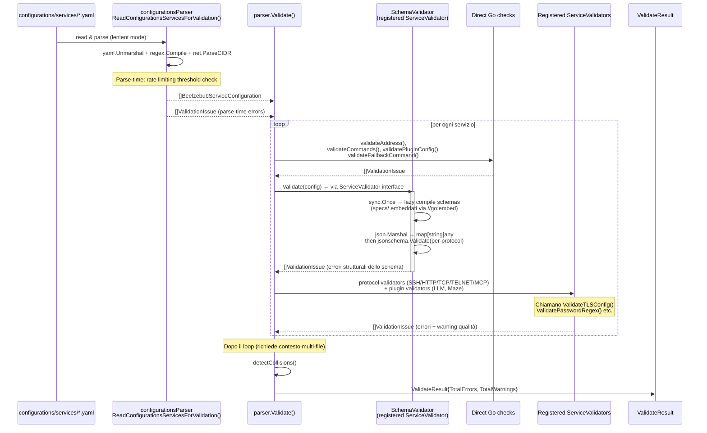

# Configuration Validation

Beelzebub uses a dual-layer validation approach for honeypot service configurations:

1. **JSON Schema (draft-07)** — validates structural correctness: required fields, types, string patterns, enum values, object shape. All violations are **hard errors**.
2. **Go procedural** — validates cross-field constraints (TLS pair, regex syntax, CIDR format), file-system existence (TLS cert files), and quality warnings (missing `deadlineTimeoutSeconds`, inline secrets, handler-less commands). Produces both **errors** and **warnings**.

## Validation flow



A standalone CLI for CI runs schema-only validation:

```
go run ./cmd/validate-specs
go run ./cmd/validate-specs -configs path/to/configs
go run ./cmd/validate-specs -specs path/to/specs   # use schemas from disk instead of the embedded ones
```

This reads YAML files, parses them, and validates against the per-protocol JSON Schema, skipping Go procedural checks. Useful for non-Go consumers or quick CI checks.

## Specs directory

`specs/` contains the JSON Schema files that define the shared validation contract:

| File | Description |
|---|---|
| `runtime-config.schema.json` | Base schema with shared fields and `$defs` (Command, Tool, Plugin, ...) |
| `runtime-ssh.schema.json` | SSH: requires `passwordRegex`, `serverVersion`, `commands` |
| `runtime-http.schema.json` | HTTP: requires `commands`, disallows `tools` |
| `runtime-tcp.schema.json` | TCP: disallows `tools` |
| `runtime-telnet.schema.json` | TELNET: requires `passwordRegex`, `commands` |
| `runtime-mcp.schema.json` | MCP: requires `tools`, disallows `commands` |

Per-protocol schemas extend the base via `allOf` + `$ref`. Conditional rules use `if/then`:

- **LLMHoneypot**: if any command or fallback uses plugin `LLMHoneypot`, the top-level `plugin` object must have `llmProvider` and `llmModel` with `minLength: 1`
- **MazeHoneypot**: if any command or fallback uses plugin `MazeHoneypot`, `protocol` must be `http`
- **Rate limiting**: if `plugin.rateLimitEnabled` is `true`, then `rateLimitRequests` and `rateLimitWindowSeconds` must be present and ≥ 1

The schemas are embedded in the Go binary via `//go:embed *.schema.json` in `specs/embed.go`.
The `SchemaValidator` that consumes them is registered via `init()` in `internal/parser/schema_validator.go`.

## Makefile targets

```
make validate-specs        # go run ./cmd/validate-specs (solo schema, per CI)
make validate-all          # validate-specs + beelzebub validate (full)
```

## How to add a new field

1. Add or modify the field in the Go struct (`internal/parser/configurations_parser.go`)
2. Add the corresponding property in `specs/runtime-config.schema.json` (and per-protocol schemas if protocol-specific)
3. Run `make validate-specs` to verify config files pass
4. Run `make validate-all` for full validation + Go procedural checks
5. If the new field needs a quality warning, add a Go procedural check

## How to add a new validator

1. Implement the `ServiceValidator` interface:
   ```go
   type ServiceValidator interface {
       Name() string
       Validate(config BeelzebubServiceConfiguration) []ValidationIssue
   }
   ```
2. Register it via `init()`:
   ```go
   func init() { parser.RegisterServiceValidator(&YourValidator{}) }
   ```
3. Ensure the package is imported with a blank identifier in `cli/validate.go` to trigger the `init()`:
   ```go
   import _ "github.com/beelzebub-labs/beelzebub/v3/internal/protocols/strategies/YOUR_PROTOCOL"
   ```
   See existing imports for SSH, HTTP, TCP, TELNET, MCP validators as examples.
4. If the validator checks structural rules, add corresponding JSON Schema constraints.

## Validation rule reference

| Category | Rule | Layer | Severity |
|---|---|---|---|
| **Protocol** | `protocol` enum {ssh, http, tcp, telnet, mcp} | Schema | Error |
| **Address** | `address` format host:port or Unix path | Schema | Error |
| **Address** | Port range 1–65535 | Go | Warning |
| **Auth** | `passwordRegex` required for SSH | Schema + Go | Error |
| **Auth** | `passwordRegex` required for TELNET | Schema + Go | Error |
| **Auth** | `passwordRegex` regex syntax | Go | Error |
| **Auth** | `serverVersion` required for SSH | Schema | Error |
| **Commands** | `commands` required for SSH (min 1) | Schema | Error |
| **Commands** | `commands` required for HTTP (min 1) | Schema | Error |
| **Commands** | `commands` required for TELNET (min 1) | Schema | Error |
| **Commands** | `commands[].regex` non-empty | Schema + Go | Error |
| **Commands** | `commands[].methods` entries non-empty and unique | Schema | Error |
| **Commands** | `commands[].plugin` enum valid | Schema | Error |
| **Commands** | `commands[].handler` empty + `plugin` empty | Go | Warning |
| **Commands** | `commands[].headers` format `key: value` | Go | Warning |
| **Commands** | `commands[].statusCode` range 100–599 | Schema | Error |
| **Fallback** | `fallbackCommand.plugin` enum valid | Schema | Error |
| **Fallback** | `fallbackCommand.regex` syntax | Go | Error |
| **Fallback** | HTTP: commands present but no fallbackCommand | Go | Warning |
| **Plugin** | LLMHoneypot → `llmProvider` + `llmModel` required | Schema | Error |
| **Plugin** | `llmProvider` must be "ollama" or "openai" when set | Go | Error |
| **Plugin** | `openAISecretKey` empty with provider "openai" | Go | Warning |
| **Plugin** | MazeHoneypot → `protocol` must be "http" | Schema | Error |
| **Plugin** | `openAISecretKey` inline (prefer env var) | Go | Warning |
| **Plugin** | `rateLimitEnabled` → `requests` + `window > 0` | Schema | Error |
| **TLS** | `tlsCertPath` + `tlsKeyPath` both or neither | Schema | Error |
| **TLS** | TLS file existence | Go | Warning |
| **Timeout** | `deadlineTimeoutSeconds` = 0 with commands | Go | Warning |
| **Tools** | `tools` disallowed for SSH/HTTP/TCP/TELNET | Schema | Error |
| **Tools** | MCP: `tools` required (min 1) | Schema | Error |
| **Tools** | MCP: `commands` disallowed | Schema | Error |
| **Tools** | MCP: `tool.name` non-empty | Go | Warning |
| **Tools** | MCP: tool has params | Go | Warning |
| **Core** | RabbitMQ URI required if enabled | Go | Error |
| **Core** | Cloud URI + authToken required if enabled | Go | Error |
| **Core** | Prometheus path + port required if configured | Go | Error |
| **Core** | `apiVersion` must be "v1" | Schema | Error |
| **Collision** | Same `protocol:address` duplicated across files | Go | Error |
| **Parse** | `regexp.Compile` on all regex fields | Go | Error |
| **Parse** | `net.ParseCIDR` on trustedProxies | Go | Error |
